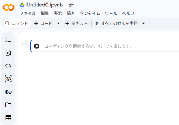

# Google Colaboratoryで角度を描画する  

## この記事でわかること

- ポイント1
- ポイント2
- ポイント3

---

## はじめに

この記事では「○○」について解説します。

私は実際に○○を経験し、その中で得た知見をまとめました。

同じ悩みを持つ方の参考になれば幸いです。

---

## 結論

先に結論をまとめます。

| 項目 | 内容 |
|--------|--------|
| おすすめ度 | ★★★★★ |
| 難易度 | 初級〜中級 |
| 必要時間 | 約○時間 |
| 費用 | ○円 |

重要なポイントは以下の3つです。

1. ○○
2. ○○
3. ○○

---

## 背景・基礎知識

まず前提となる知識を説明します。

### ○○とは

○○とは〜です。

### なぜ重要なのか

理由は以下の通りです。

- 理由1
- 理由2
- 理由3
```

---
まず、貼ってみます



~~~~~~~~~~~~~~~~
test123TEST
~~~~~~~~~~~~~~~~


## これもテストです。

test123TEST
~~~~~~~~~~~

### これもテストです。

テスト
~~~~~~~~~~~
```markdown


# タイトル

## この記事でわかること

- ポイント1
- ポイント2
- ポイント3

...
```
